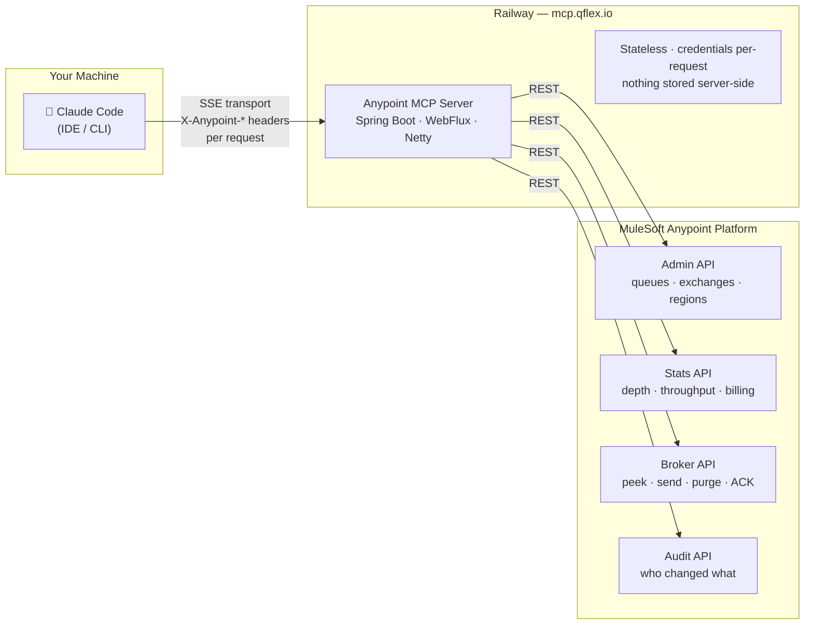

# Anypoint MQ MCP Server

A [Model Context Protocol (MCP)](https://modelcontextprotocol.io) server for **MuleSoft Anypoint MQ**. Operate Anypoint MQ from Claude Code — inspect queue depth and stats, triage and redrive dead-letter queues, send/consume messages, and analyze MQ cost. It also surfaces supporting Anypoint reads (app status, logs, monitoring) for MQ incident triage and health scoring.

> Scope today is **Anypoint MQ**. The server keeps the general `anypoint-mcp` name so more Anypoint domains can be added later without reconfiguring clients.

## Architecture



> Credentials flow in with every request — client ID, secret, and org ID as HTTP headers.
> The server holds no state and no secrets of its own.

## Tools

| Tool | API | Tier |
|------|-----|------|
| `listEnvironments` / `resolveEnvironment` | Platform | Free |
| `listApplications` / `getApplication` | Runtime Manager (CH1) | Free |
| `getApplicationLogs` | Runtime Manager (CH1) | Free |
| `restartApplication` | Runtime Manager (CH1) | **Pro** |
| `deployApplication` / `scaleWorkers` | Runtime Manager (CH1) | **Pro** |
| `setEnvironmentVariables` | Runtime Manager (CH1) | **Pro** |
| `listCh2Applications` / `getCh2Application` | Runtime Manager (CH2/RTF) | Free |
| `scaleCh2Replicas` / `restartCh2Application` | Runtime Manager (CH2/RTF) | **Pro** |
| `listApis` | API Manager | Free |
| `applyPolicy` / `removePolicy` | API Manager | **Pro** |
| `searchAssets` / `getAssetSpec` | Exchange | Free |
| `listDestinations` / `listRegions` / `getQueueDepth` / `getQueueStats` | Anypoint MQ | Free |
| `peekMessages` / `getMqUsage` / `getMqAuditLog` | Anypoint MQ | Free |
| `triageDeadLetterQueues` | Anypoint MQ | Free |
| `sendMessage` / `consumeMessages` | Anypoint MQ | **Pro** |
| `purgeQueue` / `createQueue` / `deleteQueue` | Anypoint MQ | **Pro** |
| `redriveMessages` | Anypoint MQ (Broker) | **Pro** |
| `analyzeMqCosts` | Anypoint MQ (Stats) | **Pro** |
| `rightsizeWorkers` | Anypoint MQ + Monitoring | **Pro** |
| `queryMetric` / `listAlerts` | Anypoint Monitoring | Free |
| `getPlatformHealthScorecard` | MQ + Platform | Free |
| `diagnoseIncident` | MQ + Platform | **Enterprise** |

Tiers are enforced by the `X-API-Key` header: **Free** (diagnosis + read), **Pro** (actions), **Enterprise** (RCA + uncapped). Free tools surface the problem and name the paid tool that fixes it.

## What You Can Ask

Natural-language prompts that map to the Anypoint MQ tools. Tier in brackets. The AI picks the tool — you just describe the goal.

**Dead-letter triage & recovery**

- "Any dead letters in Production, and what's failing?" → `triageDeadLetterQueues` *(Free)*
- "Show the dead-letter backlog and group the errors by type" → `triageDeadLetterQueues` *(Free)*
- "Dry-run a redrive of `orders-dlq` back into `orders-queue`" → `redriveMessages` (dryRun) *(Pro)*
- "Replay the recoverable messages from `orders-dlq` into `orders-queue`" → `redriveMessages` *(Pro)*

**Health & incident triage**

- "Give me a health scorecard for Production" → `getPlatformHealthScorecard` *(Free)*
- "Grade our Anypoint MQ setup and tell me what to fix" → `getPlatformHealthScorecard` *(Free)*
- "Diagnose what happened to `orders-api` in the last 6 hours" → `diagnoseIncident` *(Enterprise)*
- "Build an incident timeline for `payments-api` and rank the likely causes" → `diagnoseIncident` *(Enterprise)*

**Cost & rightsizing (FinOps)**

- "What is our Anypoint MQ costing and where's the waste?" → `analyzeMqCosts` *(Pro)*
- "Estimate MQ spend for the last 30 days at $0.10 per billable unit and find idle queues" → `analyzeMqCosts` *(Pro)*
- "Which apps are overprovisioned and can be downsized?" → `rightsizeWorkers` *(Pro)*
- "Rightsize workers in Production based on CPU utilization" → `rightsizeWorkers` *(Pro)*

**Everyday MQ ops** (existing)

- "How deep is `orders-queue` right now?" → `getQueueDepth` *(Free)*
- "Peek at the next 5 messages in `payments-dlq`" → `peekMessages` *(Free)*
- "Send a test message to `orders-queue`" → `sendMessage` *(Pro)*

> Redrive is client-side consume-then-republish: it is at-least-once and republished messages get new messageIds. Always dry-run first. The `$`-per-billable-unit for cost is your contracted rate, passed in — it is never hardcoded.

## Quick Start (stdio — Claude Code local)

### 1. Prerequisites

- Java 17+
- Connected App with these scopes: `Runtime Manager`, `API Manager`, `Exchange Viewer`, `Anypoint MQ`

### 2. Download the JAR

```bash
curl -L https://github.com/netflexity/netflexity-anypoint-mcp/releases/latest/download/netflexity-anypoint-mcp.jar \
  -o anypoint-mcp.jar
```

### 3. Add to Claude Code

```bash
claude mcp add anypoint -- java \
  -DANYPOINT_CLIENT_ID=your_client_id \
  -DANYPOINT_CLIENT_SECRET=your_client_secret \
  -DANYPOINT_ORG_ID=your_org_id \
  -DANYPOINT_DEFAULT_ENV=Production \
  -jar /path/to/anypoint-mcp.jar
```

Or edit `.claude/mcp.json`:

```json
{
  "mcpServers": {
    "anypoint": {
      "command": "java",
      "args": [
        "-DANYPOINT_CLIENT_ID=your_client_id",
        "-DANYPOINT_CLIENT_SECRET=your_client_secret",
        "-DANYPOINT_ORG_ID=your_org_id",
        "-jar", "/path/to/anypoint-mcp.jar"
      ]
    }
  }
}
```

## Hosted Mode (SSE — Railway)

Deploy on Railway with these env vars:

| Variable | Description |
|----------|-------------|
| `ANYPOINT_CLIENT_ID` | Connected App client ID |
| `ANYPOINT_CLIENT_SECRET` | Connected App client secret |
| `ANYPOINT_ORG_ID` | Anypoint organization ID |
| `ANYPOINT_DEFAULT_ENV` | Default environment name (e.g. `Production`) |
| `ADMIN_KEY` | Secret key for `/admin/audit` endpoint |
| `SPRING_PROFILES_ACTIVE` | Set to `sse` for hosted mode |

Add to Claude Code:

```bash
claude mcp add anypoint-hosted \
  --transport sse \
  --url https://your-railway-app.railway.app/mcp/sse \
  --header "X-API-Key: your_license_key"
```

## Connected App Setup

In Anypoint Platform → Access Management → Connected Apps → Create app:

- **Type**: App acts on its own behalf (client credentials)
- **Scopes**: Design Center, Exchange Viewer, Runtime Manager, API Manager, Anypoint MQ

## Rate Limits

| Tier | Requests/min | Write Tools |
|------|-------------|-------------|
| Free | 60 | Read-only |
| Pro ($49/mo) | 600 | All tools |
| Enterprise ($199/mo) | Unlimited | All tools + audit log |

## Build from Source

```bash
git clone https://github.com/netflexity/netflexity-anypoint-common.git
cd netflexity-anypoint-common && mvn clean install -DskipTests

git clone https://github.com/netflexity/netflexity-anypoint-mcp.git
cd netflexity-anypoint-mcp && mvn clean package -DskipTests
```
